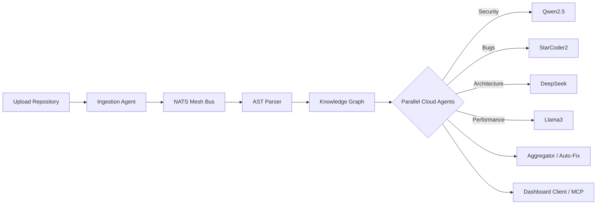

<div align="center">
  
</div>

# ZEROGATE — Code Intelligence & Security Platform

> **An enterprise-grade, AI-native code intelligence ecosystem that automatically clusters into a knowledge graph and utilizes multi-agent parallel AI orchestration to autonomously discover, explain, and auto-fix codebase vulnerabilities, architecture logic, and bugs.**

[](https://opensource.org/licenses/MIT)
[](https://golang.org/)
[](https://nextjs.org/)

**ZEROGATE** ingests entire codebases (via URL or CLI upload), parses them into a structurally queryable knowledge graph, runs **9 specialized AI agents in parallel**, and actively generates exact diff patches for human approval.

---

## 🚀 Features

- **Knowledge Graph-First Approach**: Every code entity (Files, Functions, Interfaces, Variables) is treated as a queryable node mapped across your entire repository.
- **Microservice Event-Bus Architecture**: Powered by Go Fiber + NATS JetStream events for sub-second scaling.
- **Model Context Protocol (MCP)**: Implements native JSON-RPC 2.0 to stream codebase state cleanly to external models.
- **Cloud LLM AI Agents**: Hardware-agnostic integrations pointing to Free-Tier Cloud providers (Google Gemini 1.5, HuggingFace Serverless, Groq/OpenRouter).
- **Auto-Fix Workflows**: Patches aren't just suggested—they're algorithmically mapped to lines utilizing `starcoder2-15b-instruct` generated diffs.
- **Real-Time Next.js Dashboard**: See parallel agent telemetry, streaming ingestion logic, and findings all live over WebSocket-like updates.

---

## 🤖 The 9 Specialized AI Agents

Instead of using one massive AI prompt, ZEROGATE splits contextual duties perfectly across a grid:

| Agent Role                 | Tech/Model Backbone                          | Responsibility                                                |
| -------------------------- | ---------------------------------------------| ------------------------------------------------------------- |
| **Ingestion Agent**        | `Go-Git` / Subprocess Archiver              | Clone Repos, filter scopes, hash configurations.              |
| **AST Parser Agent**       | `go-tree-sitter`                            | Map semantic structures deterministically into RAM.           |
| **Bug Detection Agent**    | `bigcode/starcoder2-7b` *(Cloud)*           | Find null pointers, logic gaps, off-by-one errors.            |
| **Security Agent**         | `qwen/qwen-2.5-coder-32b-instruct` *(Cloud)*| Identify CWE vulnerabilities, SQLi, CSRF, Leaked Tokens.      |
| **Architecture Agent**     | `DeepSeek-Coder-V2` *(Cloud)*               | Reveal God-objects, circular dependencies, SRP violations.    |
| **Performance Agent**      | `meta-llama/CodeLlama-34b` *(Cloud)*        | Flag N+1 DB loops, heavy allocations, slow algorithms.        |
| **Auto-Fix Agent**         | `starcoder2-15b-instruct` *(Cloud)*         | Generate zero-hallucination unified patch files.              |
| **Validation Agent**       | Docker Sandbox Simulator                    | Synthetically test proposed changes *(Coming Soon)*           |
| **Knowledge Graph Agent**  | `Memgraph` + `BAAI/bge-m3` Embeddings       | Construct semantic search bridges dynamically.                |

---

## 🛠 Tech Stack

- **Backend / Core Engine**: Go 1.23, Fiber v2, Tree-Sitter
- **Frontend / Dashboard**: Next.js 15 App Router, React, CSS Modules, Lucide Icons
- **Eventing / Messaging**: NATS JetStream 
- **Relational Memory**: PostgreSQL 16
- **Graph & Vector State**: Memgraph, Qdrant
- **AI Integration**: Custom `mcp` Cloud Provider Routers fetching from HuggingFace, Gemini, and OpenRouter APIs natively.

---

## ⚙️ Getting Started (Local Development)

### 1. Prerequisites
- Docker & Docker Compose
- Node.js `v20+` (and npm/yarn)
- Go `1.21+`

### 2. Environment Variables & API Keys
Copy `.env` and fill the variables. Since we configured Cloud APIS to keep performance high and hardware requirements non-existent, provide standard free keys.
```bash
# Add keys to the root .env
HF_TOKEN="hf_your_free_token"
OPENROUTER_API_KEY="sk-or-v1-..."
GEMINI_API_KEY="AIzaSy..."
```
*(Note: Empty keys will not crash the server. ZEROGATE safely mocks the output strings to keep UI telemetry working!)*

### 3. Spin Up Infrastructure
You need PostgreSQL, Memgraph, NATS, and Qdrant active to act as the core memory pipeline.
```bash
docker-compose up -d
```

### 4. Boot Go API & Agents
Wait 10 seconds for databases to mount, then execute the backend engine:
```bash
cd api
go run main.go
```
The API is now alive at `http://localhost:8000`.

### 5. Launch Next.js Dashboards
```bash
cd web
npm install
npm run dev
```
Navigate your browser to `http://localhost:3000` to start ingesting repositories!

---

## 🧩 Architecture Snapshot



## 🤝 Contributing
Contributions are welcome. Please ensure your `go fmt` structures align and Next.js builds successfully before issuing any pull requests.

## 📄 License
This platform is published underneath the [MIT License](LICENSE).
