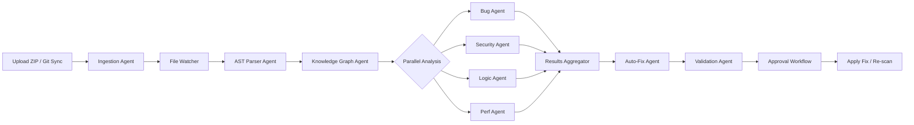

# ZEROGATE — Enterprise Architecture Blueprint

> **AI-Powered Code Intelligence & Security Platform**
> Version 1.0 · April 2026

---

## 1. Executive Architecture Overview

ZEROGATE is an enterprise-grade, AI-native code intelligence and security platform. It ingests entire codebases—via ZIP upload or Git sync—parses them into a unified knowledge graph, runs 9 specialized AI agents in parallel, and surfaces bugs, vulnerabilities, architecture issues, and performance bottlenecks with explainable root-cause analysis and one-click auto-fix.

### Competitive Positioning

| Competitor | ZEROGATE Advantage |
|---|---|
| **Snyk** | Deeper semantic analysis via knowledge graph + multi-agent AI |
| **SonarQube** | AI-powered explanations, auto-fix, real-time sync |
| **CodeRabbit** | Full codebase understanding (not just PR diffs) |
| **GitHub Copilot Security** | Open-source agents, self-hostable, multi-provider |
| **Sourcegraph Cody** | Security-first design with vulnerability lineage tracking |

### Core Differentiators
1. **Knowledge Graph-first** — Every code entity is a node; every relationship is queryable
2. **Multi-agent parallelism** — 9 agents run concurrently, each with deep specialization
3. **MCP-native** — Model-agnostic routing across AI providers via Model Context Protocol
4. **Approval-gated auto-fix** — AI generates patches; humans approve before merge
5. **Real-time sync** — File watcher triggers incremental re-analysis in <2s

---

## 2. Full System Architecture Diagram

```
┌─────────────────────────────────────────────────────────────────────────────┐
│                           ZEROGATE PLATFORM                                │
├─────────────────────────────────────────────────────────────────────────────┤
│                                                                             │
│  ┌──────────────┐   ┌──────────────┐   ┌──────────────┐                     │
│  │  Web Client   │   │  CLI Client   │   │  CI/CD Hook   │                  │
│  │  (Next.js)    │   │  (Go Binary)  │   │  (GH Action)  │                  │
│  └──────┬───────┘   └──────┬───────┘   └──────┬───────┘                    │
│         │                  │                   │                            │
│         └──────────────────┼───────────────────┘                            │
│                            ▼                                                │
│  ┌─────────────────────────────────────────────────────────────────────┐    │
│  │                      API GATEWAY (Kong / Traefik)                   │    │
│  │              Rate Limiting · Auth (JWT/OAuth2) · TLS               │    │
│  └─────────────────────────────┬───────────────────────────────────────┘    │
│                                ▼                                            │
│  ┌─────────────────────────────────────────────────────────────────────┐    │
│  │                  CORE API LAYER (Go / Fiber)                        │    │
│  │  ┌────────────┐ ┌────────────┐ ┌────────────┐ ┌────────────┐      │    │
│  │  │ Project    │ │ Analysis   │ │ Fix        │ │ Auth       │      │    │
│  │  │ Service    │ │ Service    │ │ Service    │ │ Service    │      │    │
│  │  └─────┬──────┘ └─────┬──────┘ └─────┬──────┘ └────────────┘      │    │
│  └────────┼──────────────┼──────────────┼─────────────────────────────┘    │
│           │              │              │                                   │
│           ▼              ▼              ▼                                   │
│  ┌─────────────────────────────────────────────────────────────────────┐    │
│  │                   EVENT BUS (NATS JetStream)                        │    │
│  │         project.uploaded · file.changed · analysis.complete         │    │
│  │         fix.proposed · fix.approved · scan.requested                │    │
│  └─────────────────────────────┬───────────────────────────────────────┘    │
│                                ▼                                            │
│  ┌─────────────────────────────────────────────────────────────────────┐    │
│  │              AGENT ORCHESTRATOR (Temporal.io)                       │    │
│  │                                                                     │    │
│  │  ┌─────────┐ ┌─────────┐ ┌─────────┐ ┌─────────┐ ┌─────────┐    │    │
│  │  │ Ingest  │ │ Parser  │ │ Bug     │ │Security │ │ Logic   │    │    │
│  │  │ Agent   │ │ Agent   │ │ Agent   │ │ Agent   │ │ Agent   │    │    │
│  │  └─────────┘ └─────────┘ └─────────┘ └─────────┘ └─────────┘    │    │
│  │  ┌─────────┐ ┌─────────┐ ┌─────────┐ ┌─────────┐               │    │
│  │  │ Perf    │ │AutoFix  │ │Validate │ │ KG/Emb  │               │    │
│  │  │ Agent   │ │ Agent   │ │ Agent   │ │ Agent   │               │    │
│  │  └─────────┘ └─────────┘ └─────────┘ └─────────┘               │    │
│  └─────────────────────────────┬───────────────────────────────────────┘    │
│                                ▼                                            │
│  ┌─────────────────────────────────────────────────────────────────────┐    │
│  │                  MCP SERVER (Model Context Protocol)                │    │
│  │  ┌──────────┐ ┌──────────┐ ┌──────────┐ ┌──────────┐             │    │
│  │  │ Ollama   │ │ vLLM     │ │ OpenAI   │ │ Anthropic│             │    │
│  │  │(Local)   │ │(GPU)     │ │(Cloud)   │ │(Cloud)   │             │    │
│  │  └──────────┘ └──────────┘ └──────────┘ └──────────┘             │    │
│  └─────────────────────────────────────────────────────────────────────┘    │
│                                                                             │
│  ┌──────────────────────── DATA LAYER ────────────────────────────────┐    │
│  │  ┌────────────┐ ┌────────────┐ ┌────────────┐ ┌────────────┐     │    │
│  │  │ PostgreSQL │ │  Qdrant    │ │  Memgraph  │ │   Redis    │     │    │
│  │  │ (Relational│ │ (Vector DB)│ │ (Graph DB) │ │  (Cache)   │     │    │
│  │  │  + pgvec)  │ │            │ │            │ │            │     │    │
│  │  └────────────┘ └────────────┘ └────────────┘ └────────────┘     │    │
│  └────────────────────────────────────────────────────────────────────┘    │
│                                                                             │
│  ┌──────────────────────── INFRA LAYER ───────────────────────────────┐    │
│  │  Kubernetes (EKS/GKE) · Docker · Terraform · ArgoCD · Prometheus  │    │
│  └────────────────────────────────────────────────────────────────────┘    │
└─────────────────────────────────────────────────────────────────────────────┘
```

### Data Flow Pipeline



---

## 3. Database Schema Design

### 3.1 PostgreSQL — Relational Schema

```sql
-- Core entities
CREATE TABLE organizations (
    id              UUID PRIMARY KEY DEFAULT gen_random_uuid(),
    name            VARCHAR(255) NOT NULL,
    slug            VARCHAR(100) UNIQUE NOT NULL,
    plan            VARCHAR(50) DEFAULT 'free',
    created_at      TIMESTAMPTZ DEFAULT NOW()
);

CREATE TABLE users (
    id              UUID PRIMARY KEY DEFAULT gen_random_uuid(),
    org_id          UUID REFERENCES organizations(id),
    email           VARCHAR(255) UNIQUE NOT NULL,
    name            VARCHAR(255),
    role            VARCHAR(50) DEFAULT 'member',
    avatar_url      TEXT,
    created_at      TIMESTAMPTZ DEFAULT NOW()
);

CREATE TABLE projects (
    id              UUID PRIMARY KEY DEFAULT gen_random_uuid(),
    org_id          UUID REFERENCES organizations(id),
    name            VARCHAR(255) NOT NULL,
    source_type     VARCHAR(20) CHECK (source_type IN ('zip','github','gitlab','bitbucket')),
    repo_url        TEXT,
    branch          VARCHAR(255) DEFAULT 'main',
    status          VARCHAR(50) DEFAULT 'pending',
    last_scan_at    TIMESTAMPTZ,
    file_count      INTEGER DEFAULT 0,
    loc_total       BIGINT DEFAULT 0,
    created_at      TIMESTAMPTZ DEFAULT NOW()
);

CREATE TABLE scans (
    id              UUID PRIMARY KEY DEFAULT gen_random_uuid(),
    project_id      UUID REFERENCES projects(id),
    triggered_by    UUID REFERENCES users(id),
    scan_type       VARCHAR(30) CHECK (scan_type IN ('full','incremental','rescan')),
    status          VARCHAR(30) DEFAULT 'queued',
    started_at      TIMESTAMPTZ,
    completed_at    TIMESTAMPTZ,
    findings_count  INTEGER DEFAULT 0,
    duration_ms     INTEGER
);

CREATE TABLE findings (
    id              UUID PRIMARY KEY DEFAULT gen_random_uuid(),
    scan_id         UUID REFERENCES scans(id),
    project_id      UUID REFERENCES projects(id),
    agent_name      VARCHAR(100) NOT NULL,
    category        VARCHAR(50), -- bug, vulnerability, smell, perf, logic, architecture
    severity        VARCHAR(20) CHECK (severity IN ('critical','high','medium','low','info')),
    title           VARCHAR(500) NOT NULL,
    description     TEXT,
    root_cause      TEXT,
    impact          TEXT,
    file_path       TEXT NOT NULL,
    line_start      INTEGER,
    line_end        INTEGER,
    code_snippet    TEXT,
    suggested_fix   TEXT,
    diff_patch      TEXT,
    status          VARCHAR(30) DEFAULT 'open', -- open, approved, fixed, dismissed, false_positive
    confidence      FLOAT,
    cwe_id          VARCHAR(20),
    cvss_score      FLOAT,
    created_at      TIMESTAMPTZ DEFAULT NOW()
);

CREATE TABLE fix_approvals (
    id              UUID PRIMARY KEY DEFAULT gen_random_uuid(),
    finding_id      UUID REFERENCES findings(id),
    approved_by     UUID REFERENCES users(id),
    action          VARCHAR(20) CHECK (action IN ('approve','reject','defer')),
    comment         TEXT,
    created_at      TIMESTAMPTZ DEFAULT NOW()
);

CREATE TABLE agent_runs (
    id              UUID PRIMARY KEY DEFAULT gen_random_uuid(),
    scan_id         UUID REFERENCES scans(id),
    agent_name      VARCHAR(100) NOT NULL,
    model_used      VARCHAR(100),
    status          VARCHAR(30) DEFAULT 'running',
    tokens_in       INTEGER,
    tokens_out      INTEGER,
    duration_ms     INTEGER,
    error_message   TEXT,
    started_at      TIMESTAMPTZ,
    completed_at    TIMESTAMPTZ
);

-- Indexes
CREATE INDEX idx_findings_project ON findings(project_id, severity);
CREATE INDEX idx_findings_scan ON findings(scan_id);
CREATE INDEX idx_scans_project ON scans(project_id, status);
CREATE INDEX idx_agent_runs_scan ON agent_runs(scan_id);
```

### 3.2 Memgraph — Knowledge Graph Schema (Cypher)

```cypher
// Node types
(:Project {id, name, language})
(:File {path, language, size, hash, loc})
(:Function {name, signature, complexity, line_start, line_end})
(:Class {name, methods_count, line_start})
(:Module {name, type})
(:Import {name, source})
(:Variable {name, type, scope})
(:Vulnerability {id, cwe, severity, description})

// Relationship types
(:File)-[:BELONGS_TO]->(:Project)
(:File)-[:IMPORTS]->(:File)
(:Function)-[:DEFINED_IN]->(:File)
(:Function)-[:CALLS]->(:Function)
(:Function)-[:READS]->(:Variable)
(:Function)-[:WRITES]->(:Variable)
(:Class)-[:DEFINED_IN]->(:File)
(:Class)-[:EXTENDS]->(:Class)
(:Class)-[:IMPLEMENTS]->(:Class)
(:Function)-[:MEMBER_OF]->(:Class)
(:Vulnerability)-[:AFFECTS]->(:Function)
(:Vulnerability)-[:LOCATED_IN]->(:File)
(:File)-[:DEPENDS_ON]->(:Module)
```

### 3.3 Qdrant — Vector Collections

```
Collection: code_embeddings
  - vector_size: 768 (BGE-M3)
  - distance: Cosine
  - payload: { project_id, file_path, entity_type, entity_name,
               language, line_start, line_end, content_hash }

Collection: doc_embeddings
  - vector_size: 768
  - distance: Cosine
  - payload: { project_id, file_path, doc_type, content_preview }
```

---

## 4. Detailed Agent Design — 9 Specialized Agents

### Agent 1: Repository Ingestion Agent

| Property | Detail |
|---|---|
| **Tool** | Custom Go service + `go-git` + `archiver/v4` |
| **Responsibility** | Accept ZIP uploads, clone Git repos, validate sources, extract files, enforce size/domain whitelists |
| **Why Selected** | `go-git` is a pure Go Git implementation — no CGo, fast, embeddable. Native ZIP handling in Go stdlib |
| **Strengths** | Sub-second clone initiation; parallel file extraction; domain validation via allowlist |
| **Weaknesses** | Large monorepos (>5GB) require streaming extraction |
| **Integration** | First stage — emits `project.ingested` event to NATS with file manifest |

### Agent 2: AST / Parser Agent

| Property | Detail |
|---|---|
| **Tool** | **Tree-sitter** (via `go-tree-sitter` bindings) |
| **Responsibility** | Parse every source file into AST; extract functions, classes, imports, control flow; build structural metadata |
| **Why Selected** | Industry standard incremental parser. Supports 9+ target languages. Used by GitHub, Neovim, Zed |
| **Strengths** | Incremental parsing (re-parse only changed regions); error-tolerant; sub-millisecond per file |
| **Weaknesses** | Language grammars need individual maintenance; doesn't understand semantics (only structure) |
| **Integration** | Consumes `project.ingested`; produces parsed AST nodes → feeds Knowledge Graph Agent |

### Agent 3: Bug Detection Agent

| Property | Detail |
|---|---|
| **Tool** | **Semgrep OSS** + **StarCoder2-7B** (via Ollama/vLLM) |
| **Responsibility** | Detect bugs, logic errors, null dereferences, race conditions, off-by-one errors, type mismatches |
| **Why Selected** | Semgrep provides deterministic rule-based detection; StarCoder2 adds AI reasoning for novel/complex bugs |
| **Strengths** | Semgrep: zero false-positive on rule matches. StarCoder2: understands code intent beyond patterns |
| **Weaknesses** | LLM may hallucinate; requires confidence thresholding |
| **Integration** | Receives AST context + knowledge graph context; outputs findings with severity + explanation |

### Agent 4: Security Vulnerability Agent

| Property | Detail |
|---|---|
| **Tool** | **Semgrep SAST** + **Trivy** (dependency scan) + **Gitleaks** (secrets) + **Qwen2.5-Coder-32B** |
| **Responsibility** | OWASP Top 10, CVE detection, dependency vulnerabilities, secrets scanning, misconfiguration, CWE classification |
| **Why Selected** | Trivy is the industry leader for container/dependency scanning. Gitleaks catches leaked credentials. Qwen2.5-Coder provides deep reasoning for complex vulnerability chains |
| **Strengths** | Multi-layer defense: static rules + dependency DB + AI reasoning |
| **Weaknesses** | Dependency DB requires regular updates; complex multi-file vuln chains need large context windows |
| **Integration** | Runs in parallel with Bug Agent; outputs CWE-tagged findings with CVSS scores |

### Agent 5: Logic / Architecture Review Agent

| Property | Detail |
|---|---|
| **Tool** | **DeepSeek-Coder-V2** (33B) via vLLM |
| **Responsibility** | Review architectural patterns, detect anti-patterns, circular dependencies, God objects, tight coupling, SRP violations |
| **Why Selected** | DeepSeek-Coder-V2 excels at long-context code understanding (128K context). Top performer on architecture-level reasoning benchmarks |
| **Strengths** | Can ingest entire module graphs; understands design patterns across languages |
| **Weaknesses** | Requires GPU (A100/H100); slower than smaller models |
| **Integration** | Consumes knowledge graph subgraphs (dependency trees, call chains); outputs architecture findings |

### Agent 6: Performance Optimization Agent

| Property | Detail |
|---|---|
| **Tool** | **CodeLlama-34B** + custom profiling heuristics |
| **Responsibility** | Detect N+1 queries, unnecessary allocations, blocking I/O, inefficient algorithms, memory leaks, unoptimized loops |
| **Why Selected** | CodeLlama-34B has strong performance reasoning; combined with static heuristics (complexity analysis from AST) |
| **Strengths** | Can reason about algorithmic complexity; detects database query patterns |
| **Weaknesses** | Cannot do dynamic profiling (static analysis only); may miss runtime-specific bottlenecks |
| **Integration** | Receives AST complexity metrics + knowledge graph data flow paths |

### Agent 7: Auto-Fix Generation Agent

| Property | Detail |
|---|---|
| **Tool** | **Aider** (open-source AI coding agent) + **StarCoder2-15B** |
| **Responsibility** | Generate unified diff patches for each finding; produce minimal, targeted fixes; maintain code style consistency |
| **Why Selected** | Aider is purpose-built for AI-driven code editing with Git awareness. StarCoder2 generates high-quality code completions |
| **Strengths** | Git-aware diffs; respects existing code style; can handle multi-file fixes |
| **Weaknesses** | Complex refactors may require human guidance; patch conflicts possible |
| **Integration** | Receives finding + surrounding code context; outputs diff patches → stored in `findings.diff_patch` |

### Agent 8: Validation / Test Agent

| Property | Detail |
|---|---|
| **Tool** | **Sandboxed Docker executor** + language-specific build/test runners |
| **Responsibility** | Apply proposed patches in sandboxed environment; run build; run existing tests; run generated smoke tests; verify no regressions |
| **Why Selected** | Deterministic validation — no AI guesswork. Real build/test execution proves fix correctness |
| **Strengths** | Ground-truth validation; catches compilation errors, test failures |
| **Weaknesses** | Requires project-specific build configuration; test coverage varies by project |
| **Integration** | Receives diff patch → applies in sandbox → runs build/test → reports pass/fail → gates approval workflow |

### Agent 9: Knowledge Graph / Embedding Agent

| Property | Detail |
|---|---|
| **Tool** | **BGE-M3** (embedding model) + **Memgraph** + **Qdrant** |
| **Responsibility** | Build and maintain the knowledge graph from AST output; generate and index semantic embeddings for all code entities; enable semantic search |
| **Why Selected** | BGE-M3 is SOTA for hybrid retrieval (dense + sparse). Memgraph provides real-time graph traversal. Qdrant enables filtered vector search |
| **Strengths** | Enables "understand the entire codebase" queries; supports incremental updates |
| **Weaknesses** | Initial indexing of large codebases is expensive; requires GPU for embedding generation |
| **Integration** | Consumes AST output → builds graph nodes/edges → generates embeddings → stores in Qdrant. Provides context to all other agents via RAG |

---

## 5. Tech Stack Recommendations

### Frontend
| Component | Technology | Rationale |
|---|---|---|
| Framework | **Next.js 15 (App Router)** | SSR, RSC, streaming, file-based routing |
| Language | **TypeScript** | Type safety, DX |
| Styling | **Vanilla CSS + CSS Variables** | Maximum control, premium design system |
| State | **Zustand** | Lightweight, minimal boilerplate |
| Real-time | **WebSocket (native)** | File watcher activity feed, scan progress |
| Charts | **Recharts** | Vulnerability severity distribution, trends |
| Code Display | **Monaco Editor** | Diff viewer, code annotation |
| Font | **Inter + JetBrains Mono** | Premium typography |

### Backend
| Component | Technology | Rationale |
|---|---|---|
| API Server | **Go (Fiber v3)** | Ultra-fast, low memory, production-grade |
| Worker Queue | **Temporal.io** | Durable workflows, retries, visibility |
| Event Bus | **NATS JetStream** | Lightweight, persistent, multi-consumer |
| Agent Orchestrator | **Temporal + custom Go scheduler** | Parallel agent execution, dependency DAG |
| Auth | **Ory Kratos + Hydra** | Open-source OAuth2/OIDC, self-hostable |
| API Gateway | **Traefik** | K8s-native, auto-discovery, rate limiting |

### Infrastructure
| Component | Technology | Rationale |
|---|---|---|
| Container Runtime | **Docker** | Standard containerization |
| Orchestration | **Kubernetes (EKS/GKE)** | Auto-scaling, GPU node pools |
| IaC | **Terraform + Pulumi** | Multi-cloud provisioning |
| CI/CD | **GitHub Actions + ArgoCD** | GitOps deployment |
| Monitoring | **Prometheus + Grafana** | Metrics, dashboards, alerting |
| Logging | **Loki + Promtail** | Log aggregation, Grafana integration |
| Tracing | **OpenTelemetry + Jaeger** | Distributed tracing across agents |
| Secrets | **HashiCorp Vault** | Secrets management |

### Database Layer
| Component | Technology | Rationale |
|---|---|---|
| SQL DB | **PostgreSQL 16** | ACID, JSON support, mature |
| Vector DB | **Qdrant** | Rust-based, filtered vector search, efficient |
| Graph DB | **Memgraph** | In-memory, real-time, Cypher-compatible |
| Cache | **Redis 7 (Dragonfly)** | Session, rate-limit, scan result caching |
| Object Store | **MinIO / S3** | ZIP files, scan artifacts |

---

## 6. AI Model Recommendations

| Role | Model | Parameters | Hosting | Context |
|---|---|---|---|---|
| Code Embeddings | **BGE-M3** (BAAI) | 568M | Self-hosted (GPU) | — |
| Bug Detection | **StarCoder2-7B** | 7B | Ollama / vLLM | 8K |
| Security Analysis | **Qwen2.5-Coder-32B** | 32B | vLLM (A100) | 128K |
| Architecture Review | **DeepSeek-Coder-V2** | 33B | vLLM (A100) | 128K |
| Performance Analysis | **CodeLlama-34B** | 34B | vLLM (A100) | 16K |
| Fix Generation | **StarCoder2-15B** | 15B | vLLM (A100) | 16K |
| Fallback / Cloud | **Claude 4 / GPT-4.1** | — | API | 200K |

**GPU Requirement**: Minimum 2× NVIDIA A100-80GB for self-hosted inference. Recommended: 4× A100 for production throughput.

---

## 7. Security Architecture

### 7.1 Repository Ingestion Security

```
Domain Allowlist:
  ✅ github.com
  ✅ gitlab.com
  ✅ bitbucket.org
  ✅ Custom enterprise Git (configurable)
  ❌ Everything else — BLOCKED

Validation pipeline:
  1. URL parsing → extract host → check allowlist
  2. DNS resolution → verify IP is not private/loopback
  3. SSRF prevention → block redirects to internal IPs
  4. Size limit → max 2GB per repository
  5. Rate limit → max 10 ingestions/hour per org
```

### 7.2 Sandbox Architecture

```
┌─────────────────────────────────────┐
│          Sandbox Environment         │
│  ┌───────────────────────────────┐  │
│  │   gVisor / Firecracker µVM    │  │
│  │   • No host filesystem access │  │
│  │   • CPU: 2 cores max          │  │
│  │   • RAM: 4GB max              │  │
│  │   • Disk: 10GB ephemeral      │  │
│  │   • Network: BLOCKED          │  │
│  │   • Timeout: 5 minutes        │  │
│  │   • Read-only source mount    │  │
│  └───────────────────────────────┘  │
└─────────────────────────────────────┘
```

### 7.3 Security Testing Modules (Defensive Only)
- **SAST**: Semgrep with OWASP, CWE rule packs
- **SCA**: Trivy for dependency CVE scanning
- **Secrets**: Gitleaks for credential detection
- **Misconfig**: Custom rules for Dockerfile, K8s manifests, CI configs
- **License**: `licensee` for OSS license compliance

### 7.4 Platform Security
- mTLS between all microservices
- JWT + RBAC for API authorization
- Audit log for every action (SOC2-ready)
- Data encryption at rest (AES-256) and in transit (TLS 1.3)
- Tenant isolation via PostgreSQL Row-Level Security

---

## 8. MCP Server Integration Design

```
┌──────────────────────────────────────────────────┐
│              ZEROGATE MCP SERVER                  │
│                                                    │
│  Exposed Tools:                                    │
│  ┌──────────────────────────────────────────────┐ │
│  │ analyze_file(path, lang) → findings[]        │ │
│  │ search_code(query, project_id) → results[]   │ │
│  │ get_graph_context(node_id) → subgraph        │ │
│  │ generate_fix(finding_id) → diff              │ │
│  │ validate_fix(finding_id, diff) → result      │ │
│  │ get_scan_status(scan_id) → status            │ │
│  └──────────────────────────────────────────────┘ │
│                                                    │
│  Exposed Resources:                                │
│  ┌──────────────────────────────────────────────┐ │
│  │ project://{id}/files → file listing          │ │
│  │ project://{id}/graph → knowledge graph data  │ │
│  │ project://{id}/findings → all findings       │ │
│  │ project://{id}/metrics → code quality stats  │ │
│  └──────────────────────────────────────────────┘ │
│                                                    │
│  Model Router:                                     │
│  ┌──────────────────────────────────────────────┐ │
│  │ Task → Model Selection Logic                 │ │
│  │                                              │ │
│  │ security_analysis → Qwen2.5-Coder-32B       │ │
│  │ bug_detection     → StarCoder2-7B           │ │
│  │ architecture      → DeepSeek-Coder-V2       │ │
│  │ fix_generation    → StarCoder2-15B          │ │
│  │ complex_reasoning → Claude 4 (fallback)     │ │
│  │                                              │ │
│  │ Routing: cost × latency × accuracy score    │ │
│  └──────────────────────────────────────────────┘ │
│                                                    │
│  Transport: JSON-RPC 2.0 over stdio / SSE         │
└──────────────────────────────────────────────────┘
```

---

## 9. Frontend Architecture

### Design System — "ZEROGATE Aesthetic"

```css
:root {
  /* Color Palette — Inspired by Essentials / Luxury Minimal */
  --zg-white:      #FAFAF8;
  --zg-cream:      #F5F0EB;
  --zg-sand:       #E8DFD5;
  --zg-brown:      #8B6F4E;
  --zg-brown-dark: #5C4A32;
  --zg-black:      #1A1A18;
  --zg-charcoal:   #2D2D2B;
  --zg-critical:   #D4483B;
  --zg-high:       #E8853D;
  --zg-medium:     #D4A847;
  --zg-low:        #6B9F6B;
  --zg-info:       #5B8DB8;

  /* Typography */
  --font-sans:     'Inter', system-ui, sans-serif;
  --font-mono:     'JetBrains Mono', monospace;

  /* Spacing (8px grid) */
  --space-1: 0.25rem; --space-2: 0.5rem; --space-3: 0.75rem;
  --space-4: 1rem;    --space-6: 1.5rem; --space-8: 2rem;

  /* Transitions */
  --ease-out: cubic-bezier(0.16, 1, 0.3, 1);
  --duration: 200ms;
}
```

### Page Structure

```
/                          → Landing Page (marketing)
/login                     → Auth (Ory Kratos)
/dashboard                 → Project overview, recent scans
/projects/new              → Upload ZIP / Connect repo
/projects/:id              → Project detail, file tree
/projects/:id/scan/:scanId → Analysis results dashboard
/projects/:id/findings     → Filterable findings list
/projects/:id/findings/:id → Finding detail + fix approval
/projects/:id/graph        → Interactive knowledge graph
/projects/:id/activity     → Real-time file watcher feed
/settings                  → Org settings, API keys
/agents                    → Agent monitoring panel
```

---

## 10. Backend Microservices Design

```
Service              Port   Responsibility
─────────────────────────────────────────────────────
api-gateway          8000   Routing, auth, rate-limiting
project-service      8001   CRUD projects, file management
scan-service         8002   Scan lifecycle, agent dispatch
findings-service     8003   Findings CRUD, aggregation
fix-service          8004   Fix generation, approval workflow
auth-service         8005   User auth, org management
webhook-service      8006   GitHub webhooks, event relay
watcher-service      8007   File watcher, change detection
embedding-service    8008   Embedding generation (GPU)
graph-service        8009   Knowledge graph CRUD
mcp-service          8010   MCP server, model routing
websocket-service    8011   Real-time updates to frontend
```

### Inter-Service Communication
- **Sync**: gRPC (service-to-service queries)
- **Async**: NATS JetStream (events, task dispatching)
- **Workflows**: Temporal (multi-step agent orchestration)

---

## 11. Scaling Strategy

| Component | Strategy | Target |
|---|---|---|
| API Layer | Horizontal pod autoscaling (HPA) | 50 req/s per pod → scale to 20 pods |
| Agent Workers | GPU node pool autoscaling | 1 A100 per 3 concurrent scans |
| PostgreSQL | Read replicas + PgBouncer | 10K concurrent connections |
| Qdrant | Sharded cluster (3 nodes) | 100M vectors |
| Memgraph | Vertical scaling (high-RAM instance) | 50M nodes/edges |
| Redis | Redis Cluster (6 nodes) | 100K ops/sec |
| NATS | 3-node JetStream cluster | 1M msg/sec |
| Object Store | S3 / MinIO | Unlimited |

### Estimated Throughput
- **Small project** (<10K LOC): Full scan in <30s
- **Medium project** (10K-100K LOC): Full scan in 2-5 min
- **Large project** (100K-1M LOC): Full scan in 10-20 min
- **Incremental re-scan**: <5s for single file change

---

## 12. DevOps / Deployment Plan

### CI/CD Pipeline

```
GitHub Push → GitHub Actions
  ├── Lint + Type Check
  ├── Unit Tests
  ├── Integration Tests (testcontainers)
  ├── Build Docker Images
  ├── Push to Container Registry (GHCR)
  ├── ArgoCD sync (staging)
  ├── Smoke Tests on staging
  └── Manual promotion → production
```

### Environment Strategy
- **Development**: Docker Compose (local)
- **Staging**: Single K8s namespace, 1 GPU node
- **Production**: Multi-AZ K8s cluster, GPU node pools, CDN

### Monitoring Stack
- **Metrics**: Prometheus → Grafana dashboards
- **Logs**: Loki + Promtail → Grafana
- **Traces**: OpenTelemetry → Jaeger
- **Alerts**: Grafana Alerting → PagerDuty/Slack
- **SLOs**: 99.9% API uptime, p95 latency <500ms

---

## 13. Monetization Suggestions

| Tier | Price | Features |
|---|---|---|
| **Free** | $0/mo | 1 project, 5 scans/mo, community agents |
| **Pro** | $49/mo/user | 10 projects, unlimited scans, all agents, fix suggestions |
| **Team** | $149/mo/user | Unlimited projects, priority GPU, GitHub integration, approval workflows |
| **Enterprise** | Custom | Self-hosted, SSO/SAML, SLA, custom agents, dedicated GPU, audit logs |

### Additional Revenue
- **Usage-based**: $0.01 per 1K LOC scanned beyond tier limit
- **Marketplace**: Third-party agent/rule packs
- **API Access**: Metered API for CI/CD integration
- **Professional Services**: Custom agent development, onboarding

---

## 14. Future Roadmap

### Phase 1 — MVP (Months 1-4)
- [x] ZIP upload + GitHub sync
- [x] Tree-sitter parsing (Python, JS, TS, Go)
- [x] Bug + Security agents (Semgrep + StarCoder2)
- [x] Basic dashboard with findings list
- [x] Fix suggestion (no auto-apply)

### Phase 2 — Core Platform (Months 5-8)
- [ ] Knowledge graph (Memgraph)
- [ ] Semantic search (Qdrant + BGE-M3)
- [ ] All 9 agents operational
- [ ] Auto-fix with approval workflow
- [ ] Real-time file watcher
- [ ] Remaining language support (Java, Rust, C/C++, PHP, Ruby)

### Phase 3 — Enterprise (Months 9-12)
- [ ] MCP Server integration
- [ ] SSO/SAML (Ory Hydra)
- [ ] Self-hosted deployment (Helm charts)
- [ ] SOC2 compliance
- [ ] Custom agent SDK
- [ ] IDE plugins (VS Code, JetBrains)

### Phase 4 — Scale (Months 13-18)
- [ ] Multi-cloud deployment (AWS, GCP, Azure)
- [ ] Agent marketplace
- [ ] PR/MR bot (auto-review on push)
- [ ] Vulnerability remediation SLA tracking
- [ ] AI-powered code documentation generation
- [ ] Compliance frameworks (HIPAA, PCI-DSS, ISO 27001)

---

## Open Questions

> [!IMPORTANT]
> **Please review and provide feedback on the following decisions:**

1. **Graph DB Choice**: Memgraph (in-memory, real-time) vs Neo4j (persistent, mature ecosystem). Memgraph is recommended for ZEROGATE's real-time incremental analysis pattern. Do you agree?

2. **Primary Backend Language**: Go is recommended for the API/worker layer due to performance and concurrency. Would you prefer Python (FastAPI) for faster prototyping?

3. **GPU Infrastructure**: Self-hosted vLLM on A100s vs cloud API fallback (OpenAI/Anthropic). The architecture supports both — should MVP start cloud-first or self-hosted-first?

4. **Frontend Framework**: Next.js 15 is recommended. Would you prefer a different framework?

5. **Deployment Target**: Should we design for cloud-only (EKS/GKE) or include on-premise/self-hosted from day one?

6. **Would you like me to proceed with building the actual codebase?** I can start with the frontend dashboard + landing page, then build out backend services incrementally.
